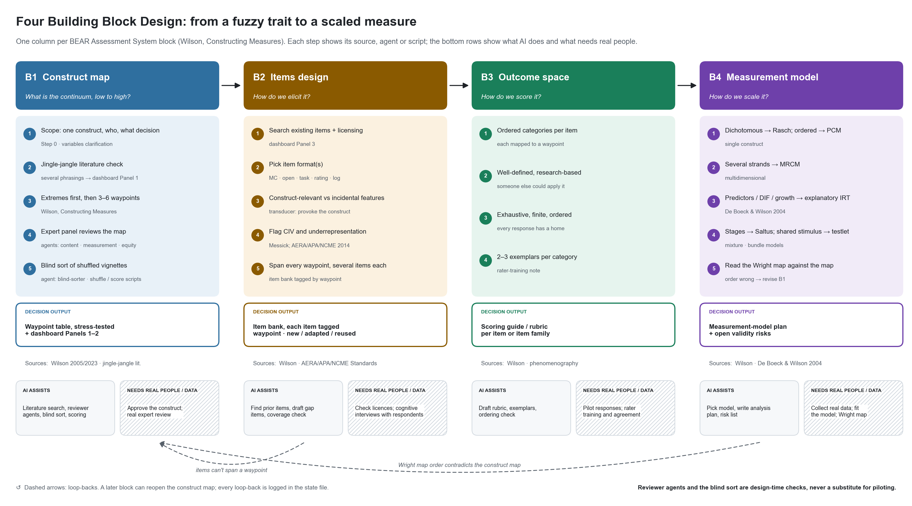

# four-building-block-design

A Claude plugin for designing a measurement instrument (test, survey, rubric, rating scale,
assessment) with Mark Wilson's **BEAR Assessment System**, the method behind *Constructing
Measures*:

**construct map → items design → outcome space → measurement model**

| Block | Decides | Output |
|---|---|---|
| B1 · Construct map | What the continuum is, low to high; whether the construct already exists under another name | Waypoint table, reviewed by an expert panel and checked by a blind sort; dashboard panels 1–2 |
| B2 · Items design | How to elicit it; which existing items can be reused (and their licences) | Item bank tagged by waypoint and origin (new / adapted / reused); dashboard panel 3 |
| B3 · Outcome space | How to score it | Ordered scoring guide per item, each category mapped to a waypoint |
| B4 · Measurement model | How to scale it and check the map against data | Model plan (Rasch / PCM / MRCM / explanatory IRT / Saltus / testlet), Wright-map check, open validity risks |



## Install

**Claude Code**
```bash
claude plugin marketplace add kkxxmmyytt2020-sketch/four-building-block-design
claude plugin install four-building-block-design@four-building-block-local
```

**Cowork (Claude desktop app)**: open the Cowork tab → Customize, and upload the plugin as a file
(zip the inner `four-building-block-design/` folder). See
[Install plugins](https://claude.com/docs/cowork/guide/plugins).

## Use

In any project folder, run `/four-building-block-design:design`, or just describe the task
("design a rubric for students' reasoning about variability"). The workflow:

1. shows the workflow figure and scopes the construct (what, who, setting, what decision the
   scores support, and whether it's really one construct);
2. **B1**: runs a jingle-jangle literature search with several phrasings, drafts the map, sends it
   to the reviewer panel, then runs the blind sort (up to two rounds);
3. **B2–B4**: searches for existing items before writing new ones, then drafts scoring guides and
   a measurement-model plan;
4. assembles the design document from `assets/design-worksheet-template.md` and links the dashboard.

Ask for an **unattended draft** if you want all four blocks at once. Every decision is then marked
*proposed*, and the questions still open are listed at the end.

Files it writes to your folder:
```
fbb-state.json                 everything decided so far (schema: skills/design/references/state-schema.md)
fbb-dashboard.html             Panel 1 existing constructs + overlap diagram · Panel 2 click-to-expand map
                               with ✓/⚠ blind-sort badges · Panel 3 existing items
stress_test/round<N>/          vignettes.json · sort_packet.json (sorter sees) · answer_key.json (sorter never sees) · sort.csv
<construct>-design.html        the final design document
```

## What the checks can't tell you

The reviewer agents and the blind sort check whether the **idea** of the construct map holds
together, before any items exist. They say nothing about how real items discriminate, how hard
they are for real respondents, how reliably raters score, or how well the model fits. For that you
need cognitive interviews, pilot data and a fitted model read as a Wright map. If the empirical
order contradicts the map, go back to B1. That feedback loop is part of the method.

## Layout
```
.claude-plugin/marketplace.json
four-building-block-design/
  .claude-plugin/plugin.json
  skills/design                  orchestrator: scope, state, gates, routing, final document (+ state schema, example)
  skills/b1-construct-map        B1 (+ construct-map guide, stress-test method, dashboard spec)
  skills/b2-items                B2 (+ items and outcome-space guide)
  skills/b3-outcome-space        B3
  skills/b4-measurement-model    B4 (+ model-selection guide)
  agents/                        blind-sorter · content-expert · measurement-reviewer · equity-reviewer
  scripts/                       shuffle_vignettes.py · blind_sort_score.py · render_dashboard.py (Python stdlib only)
  scripts/tests/                 python3 -m unittest discover -s scripts/tests
  assets/                        workflow.png (+ src/make_workflow_figure.py) · dashboard template · design worksheet
  evals/                         variability (B1 only) · postop-mobility (all four blocks): claude plugin eval .
```

## Sources

Wilson, M. (2005; 2nd ed. 2023). *Constructing Measures: An Item Response Modeling Approach*.
De Boeck, P., & Wilson, M. (Eds.) (2004). *Explanatory Item Response Models*.
AERA, APA, & NCME (2014). *Standards for Educational and Psychological Testing*.
These sources are cited and paraphrased, not bundled. Found items and definitions are
paraphrased, and restricted items are never reproduced.
